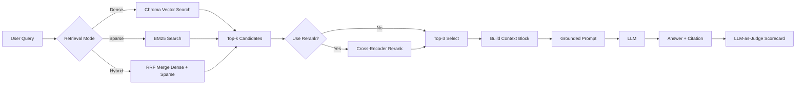

# Architecture — RAG Pipeline (Day 08 Lab)

> Deliverable của Documentation Owner.
> Tài liệu này được cập nhật theo kết quả chạy Sprint 4 ngày 13 - 04 - 2026.

## 1. Tổng quan kiến trúc

```text
[Raw Docs in data/docs]
    ↓
[index.py: preprocess → section-aware chunking → embedding → Chroma upsert]
    ↓
[ChromaDB collection: rag_lab]
    ↓
[rag_answer.py: query → dense/sparse/hybrid retrieve → optional rerank]
    ↓
[Grounded prompt with citations]
    ↓
[LLM answer + sources]
    ↓
[eval.py: scorecard + A/B comparison]
```

**Mô tả ngắn gọn:**
Nhóm xây dựng một trợ lý nội bộ cho khối CS + IT Helpdesk để trả lời câu hỏi về SLA sự cố, chính sách hoàn tiền, quy trình cấp quyền và FAQ vận hành. Hệ thống dùng RAG để chỉ trả lời từ tài liệu nội bộ đã index, có citation nguồn, đồng thời hỗ trợ so sánh baseline và variant retrieval bằng scorecard.

---

## 2. Indexing Pipeline (Sprint 1)

### Tài liệu được index

| File | Nguồn | Department | Số chunk |
|------|-------|-----------|---------|
| `policy_refund_v4.txt` | `policy/refund-v4.pdf` | CS | 6 |
| `sla_p1_2026.txt` | `support/sla-p1-2026.pdf` | IT | 5 |
| `access_control_sop.txt` | `it/access-control-sop.md` | IT Security | 8 |
| `it_helpdesk_faq.txt` | `support/helpdesk-faq.md` | IT | 6 |
| `hr_leave_policy.txt` | `hr/leave-policy-2026.pdf` | HR | 5 |

Tổng số chunk hiện có trong collection `rag_lab`: `30`.

### Quyết định chunking

| Tham số | Giá trị | Lý do |
|---------|---------|-------|
| Chunk size | 400 tokens (ước lượng bằng `len(text) / 4`) | Nằm trong khuyến nghị 300-500 tokens, đủ dài để giữ ngữ cảnh chính sách/SOP nhưng chưa quá dài cho prompt |
| Overlap | 80 tokens | Giảm rủi ro mất ý ở ranh giới giữa hai chunk |
| Chunking strategy | Section-aware + paragraph/whitespace split | Tách theo heading `=== ... ===` trước, sau đó mới cắt theo kích thước để giữ nguyên cấu trúc điều khoản |
| Metadata fields | `source`, `section`, `department`, `effective_date`, `access` | Phục vụ citation, debug retrieval, lọc theo tài liệu và kiểm tra freshness |

### Embedding model

- **Thiết kế hỗ trợ 2 chế độ**:
  - OpenAI embeddings: `text-embedding-3-small` nếu có `OPENAI_API_KEY`
  - Local SentenceTransformer: `paraphrase-multilingual-MiniLM-L12-v2` nếu không có OpenAI key
- **Vector store**: ChromaDB `PersistentClient`, collection `rag_lab`
- **Similarity metric**: Cosine similarity
- **Lưu ý từ lần chạy hiện tại**: collection đang có dimension `384`, tương ứng với nhánh SentenceTransformer local. Đây cũng là lý do lần chạy cuối bị lỗi khi upsert embedding `1536` chiều.

---

## 3. Retrieval Pipeline (Sprint 2 + 3)

### Baseline (Sprint 2)

| Tham số | Giá trị |
|---------|---------|
| Strategy | Dense retrieval bằng embedding similarity trong ChromaDB |
| Top-k search | 10 |
| Top-k select | 3 |
| Rerank | Không |
| Query transform | Không |

### Variant đã chạy (Sprint 3)

| Tham số | Giá trị | Thay đổi so với baseline |
|---------|---------|------------------------|
| Strategy | Hybrid retrieval | Kết hợp dense + sparse/BM25 thay vì chỉ dense |
| Top-k search | 10 | Giữ nguyên để tuân thủ A/B rule |
| Top-k select | 3 | Giữ nguyên |
| Rerank | Có, dùng cross-encoder | Thêm bước chấm lại độ liên quan trước khi vào prompt |
| Query transform | Không | Giữ nguyên để không đổi quá nhiều biến ngoài retrieval stack |

### Chi tiết variant

- **Dense branch**: truy vấn trực tiếp vào ChromaDB bằng embedding query
- **Sparse branch**: BM25 (`rank_bm25`) trên toàn bộ corpus chunk text
- **Fusion**: Reciprocal Rank Fusion (RRF), mặc định `dense_weight=0.6`, `sparse_weight=0.4`, `RRF_K=60`
- **Rerank model**: `cross-encoder/ms-marco-MiniLM-L-6-v2`

**Lý do chọn variant này:**
Corpus của bài lab không chỉ có câu văn tự nhiên mà còn có keyword, alias và mã định danh như `P1`, `Approval Matrix`, `Level 3`, `IT-ACCESS`. Vì vậy nhóm thử hybrid để tăng khả năng bắt exact-match bằng BM25, sau đó dùng cross-encoder rerank để giảm noise trước khi chọn 3 chunk cuối cho prompt.

---

## 4. Generation (Sprint 2)

### Grounded Prompt Template

```text
Answer only from the retrieved context below.
If the context is insufficient to answer the question, say you do not know and do not make up information.
Cite the source field (in brackets like [1]) when possible.
Keep your answer short, clear, and factual.
Respond in the same language as the question.

Question: {query}

Context:
[1] {source} | {section} | score={score}
{chunk_text}

[2] ...

Answer:
```

### LLM Configuration

| Tham số | Giá trị |
|---------|---------|
| Model | `gpt-4o-mini` mặc định nếu có OpenAI key; fallback `gemini-1.5-flash` nếu dùng Google key |
| Temperature | 0 |
| Max tokens | 512 |

### Quy tắc generation

- Chỉ trả lời từ retrieved context
- Không đủ dữ liệu thì phải abstain
- Cố gắng gắn citation `[1]`, `[2]`
- Trả lời cùng ngôn ngữ với câu hỏi

---

## 5. Evaluation Architecture (Sprint 4)

### Scorecard setup

- File đánh giá: `eval.py`
- Tập test: `data/test_questions.json`
- 4 metric:
  - Faithfulness
  - Answer Relevance
  - Context Recall
  - Completeness
- Cách chấm: `LLM-as-Judge` trong các hàm `score_*`

### Kết quả A/B đã chạy

| Metric | Baseline | Variant | Delta |
|--------|----------|---------|-------|
| Faithfulness | 4.40 | 4.20 | -0.20 |
| Relevance | 4.50 | 4.10 | -0.40 |
| Context Recall | 5.00 | 5.00 | 0.00 |
| Completeness | 3.90 | 3.70 | -0.20 |

### Diễn giải ngắn

- Baseline dense hiện đang tốt hơn variant hybrid + rerank trên trung bình toàn bộ 10 câu hỏi.
- Variant chỉ cải thiện nhẹ ở `q04` và `q10`, nhưng giảm mạnh ở `q09` (`ERR-403-AUTH`) vì câu trả lời chuyển thành `"Tôi không biết"` nên bị judge chấm rất thấp về relevance/completeness.
- `Context Recall = 5.00` cho cả hai cấu hình cho thấy retrieve đã lấy đúng tài liệu kỳ vọng, nhưng generation/compression vẫn làm mất ý ở một số câu như `q07` và `q10`.

### Kết luận kiến trúc hiện tại

Kiến trúc retrieval hiện tại hoạt động ổn về recall nhưng chưa tối ưu về answer completeness. Với kết quả đã có, baseline dense nên được xem là cấu hình mặc định an toàn hơn cho demo hiện tại; variant hybrid + rerank mới chỉ chứng minh được khả năng thử nghiệm, chưa chứng minh được cải thiện chất lượng tổng thể.

---

## 6. Failure Mode Checklist

> Dùng khi debug theo thứ tự: index → retrieval → generation → evaluation

| Failure Mode | Triệu chứng | Cách kiểm tra |
|-------------|-------------|---------------|
| Index lỗi | Retrieve về docs cũ / sai version | `inspect_metadata_coverage()` trong `index.py` |
| Chunking tệ | Chunk cắt giữa điều khoản, answer thiếu nửa ý | `list_chunks()` và đọc text preview |
| Retrieval lỗi | Không tìm được expected source | `score_context_recall()` trong `eval.py` |
| Generation lỗi | Answer không grounded / bịa | `score_faithfulness()` trong `eval.py` |
| Compression lỗi | Có đúng source nhưng answer thiếu tên mới, ngoại lệ, điều kiện | So sánh `chunks_used` với `answer`, nhất là ở `q04`, `q07`, `q10` |
| Token overload | Context quá dài, lost in the middle | Kiểm tra `context_block` và số chunk đưa vào prompt |
| Embedding dimension mismatch | `chromadb.errors.InvalidArgumentError: Collection expecting embedding with dimension of 384, got 1536` | Kiểm tra backend embedding đang dùng và dimension của collection hiện có |

### Ghi chú vận hành về lỗi dimension mismatch

Lỗi cuối log:

```text
chromadb.errors.InvalidArgumentError:
Collection expecting embedding with dimension of 384, got 1536
```

Nguyên nhân kiến trúc:

- Collection `rag_lab` đã được tạo bằng embedding `384` chiều từ `paraphrase-multilingual-MiniLM-L12-v2`
- Ở lần chạy sau, code chuyển sang embedding `1536` chiều từ OpenAI
- ChromaDB không cho upsert/query embedding khác chiều vào cùng một collection

Hướng xử lý đúng:

1. Giữ nguyên cùng một embedding backend cho cả index và query
2. Hoặc xóa/rebuild collection khi đổi embedding model
3. Ghi rõ embedding backend trong tài liệu và `.env` để tránh chạy lẫn hai cấu hình

---

## 7. Diagram

